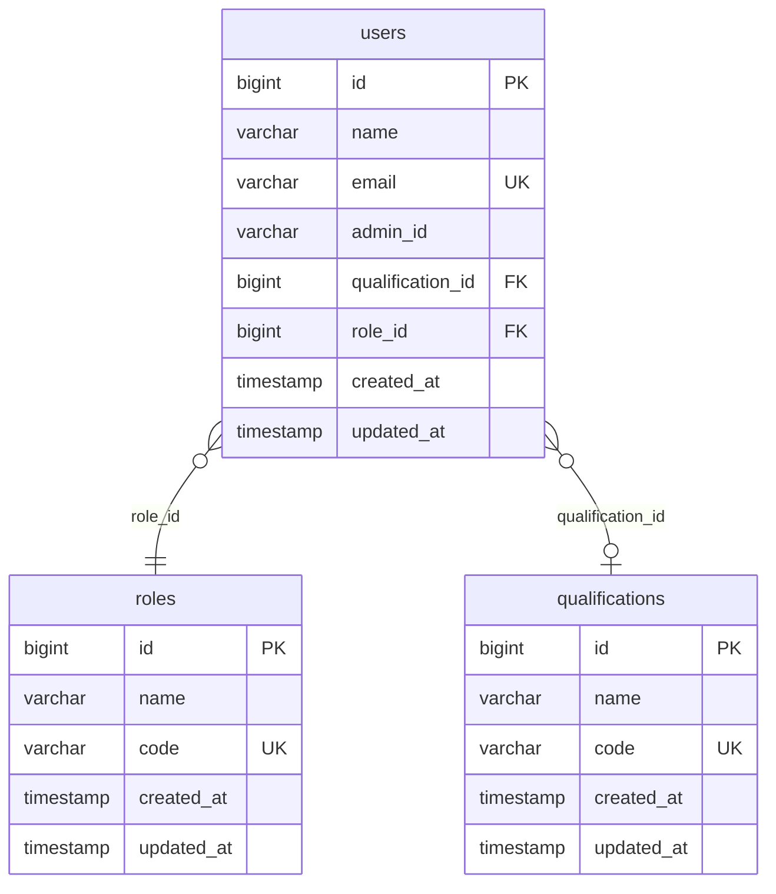
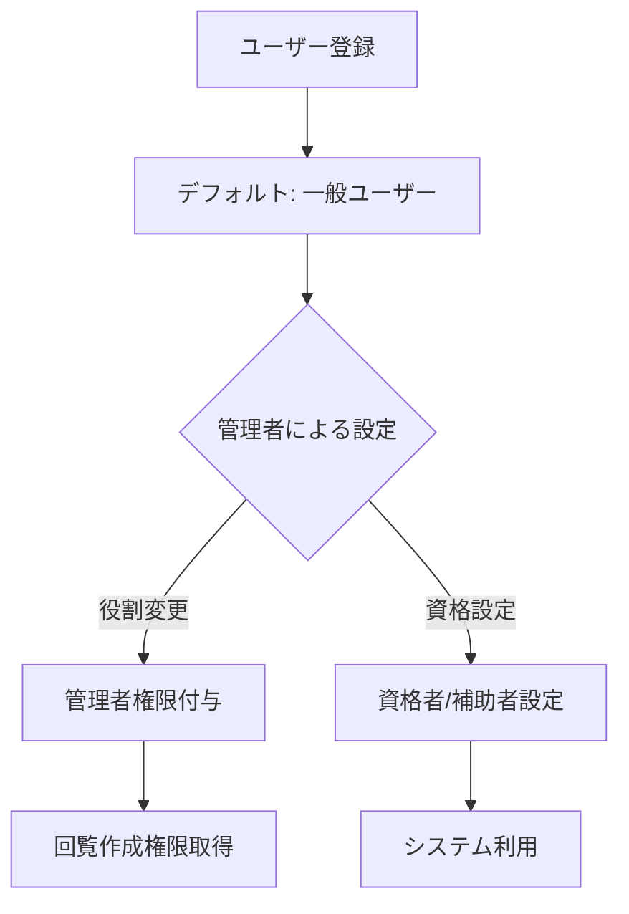

# ルックアップテーブル設計ドキュメント

## 概要

Laravel Breezeを使った社内Web回覧システムの開発において、SQLアンチパターンを回避するためのルックアップテーブル設計を実装。

## 前提条件

- Laravel Breeze インストール済み
- Docker環境（Laravel Sail）
- Windows環境
- 既存Userテーブル構造:

```
+-------------------+-----------------+------+-----+---------+----------------+
| Field             | Type            | Null | Key | Default | Extra          |
+-------------------+-----------------+------+-----+---------+----------------+
| id                | bigint unsigned | NO   | PRI | NULL    | auto_increment |
| name              | varchar(255)    | NO   |     | NULL    |                |
| email             | varchar(255)    | NO   | UNI | NULL    |                |
| email_verified_at | timestamp       | YES  |     | NULL    |                |
| password          | varchar(255)    | NO   |     | NULL    |                |
| remember_token    | varchar(100)    | YES  |     | NULL    |                |
| created_at        | timestamp       | YES  |     | NULL    |                |
| updated_at        | timestamp       | YES  |     | NULL    |                |
+-------------------+-----------------+------+-----+---------+----------------+
```

## DDLとは？

DDL（Data Definition Language）= データ定義言語

- データベースの**構造**を定義するSQL
- `CREATE`, `ALTER`, `DROP`文など  
- テーブル作成、カラム追加、制約設定

| DDL文 | 用途 | 例 |
|-------|------|-----|
| CREATE | テーブル作成 | `CREATE TABLE users (...)` |
| ALTER | テーブル修正 | `ALTER TABLE users ADD COLUMN role_id` |
| DROP | テーブル削除 | `DROP TABLE temp_table` |

## 設計方針

### SQLアンチパターン回避

**サーティワンフレーバー（31のフレーバー）アンチパターン**
- ENUMのように限定する値を列定義で指定してはいけない
- 解決策：参照テーブル（ルックアップテーブル）を使用

### 設計手法
- **正規化（第3正規形）**
- **ルックアップテーブルパターン**
- 固定的な値のセット管理

## ER図



## システムフロー



## 実装手順

### 1. rolesテーブル作成

```bash
sail artisan make:migration create_roles_table
```

**マイグレーション内容:**
```php
<?php
use Illuminate\Database\Migrations\Migration;
use Illuminate\Database\Schema\Blueprint;
use Illuminate\Support\Facades\Schema;
use Illuminate\Support\Facades\DB;

return new class extends Migration
{
    public function up(): void
    {
        Schema::create('roles', function (Blueprint $table) {
            $table->id();
            $table->string('name');
            $table->string('code')->unique();
            $table->timestamps();
        });

        // 初期データ挿入
        DB::table('roles')->insert([
            ['name' => '一般', 'code' => 'general', 'created_at' => now(), 'updated_at' => now()],
            ['name' => '管理者', 'code' => 'admin', 'created_at' => now(), 'updated_at' => now()],
        ]);
    }

    public function down(): void
    {
        Schema::dropIfExists('roles');
    }
};
```

### 2. qualificationsテーブル作成

```bash
sail artisan make:migration create_qualifications_table
```

**マイグレーション内容:**
```php
<?php
use Illuminate\Database\Migrations\Migration;
use Illuminate\Database\Schema\Blueprint;
use Illuminate\Support\Facades\Schema;
use Illuminate\Support\Facades\DB;

return new class extends Migration
{
    public function up(): void
    {
        Schema::create('qualifications', function (Blueprint $table) {
            $table->id();
            $table->string('name');
            $table->string('code')->unique();
            $table->timestamps();
        });

        // 初期データ挿入
        DB::table('qualifications')->insert([
            ['name' => '補助者', 'code' => 'assistant', 'created_at' => now(), 'updated_at' => now()],
            ['name' => '資格者', 'code' => 'qualified', 'created_at' => now(), 'updated_at' => now()],
        ]);
    }

    public function down(): void
    {
        Schema::dropIfExists('qualifications');
    }
};
```

### 3. usersテーブル修正

```bash
sail artisan make:migration add_foreign_keys_to_users_table --table=users
```

**マイグレーション内容:**
```php
<?php
use Illuminate\Database\Migrations\Migration;
use Illuminate\Database\Schema\Blueprint;
use Illuminate\Support\Facades\Schema;

return new class extends Migration
{
    public function up(): void
    {
        Schema::table('users', function (Blueprint $table) {
            $table->string('admin_id')->nullable();
            $table->unsignedBigInteger('qualification_id')->nullable();
            $table->unsignedBigInteger('role_id')->default(1);
            
            $table->foreign('qualification_id')->references('id')->on('qualifications');
            $table->foreign('role_id')->references('id')->on('roles');
        });
    }

    public function down(): void
    {
        Schema::table('users', function (Blueprint $table) {
            $table->dropForeign(['qualification_id']);
            $table->dropForeign(['role_id']);
            $table->dropColumn(['admin_id', 'qualification_id', 'role_id']);
        });
    }
};
```

## Eloquentモデル設定

### Eloquentリレーションとは

**ORM（Object-Relational Mapping）**によるデータベースリレーション管理

| リレーション | 関係 | 使用ケース | メソッド |
|-------------|------|-----------|----------|
| belongsTo | 多対1 | 子→親 | `$user->role` |
| hasMany | 1対多 | 親→子 | `$role->users` |
| belongsToMany | 多対多 | 中間テーブル | `$user->readCirculars` |

### Roleモデル

```php
<?php
namespace App\Models;
use Illuminate\Database\Eloquent\Model;

class Role extends Model
{
    protected $fillable = ['name', 'code'];

    /**
     * このロールを持つユーザー（1対多の関係）
     */
    public function users()
    {
        return $this->hasMany(User::class);
    }

    /**
     * 管理者ロールかどうかを判定
     */
    public function isAdmin(): bool
    {
        return $this->code === 'admin';
    }

    /**
     * 一般ユーザーロールかどうかを判定
     */
    public function isGeneral(): bool
    {
        return $this->code === 'general';
    }
}
```

### Qualificationモデル

```php
<?php
namespace App\Models;
use Illuminate\Database\Eloquent\Model;

class Qualification extends Model
{
    protected $fillable = ['name', 'code'];

    /**
     * この資格を持つユーザー（1対多の関係）
     */
    public function users()
    {
        return $this->hasMany(User::class);
    }

    /**
     * 資格者かどうかを判定
     */
    public function isQualified(): bool
    {
        return $this->code === 'qualified';
    }

    /**
     * 補助者かどうかを判定
     */
    public function isAssistant(): bool
    {
        return $this->code === 'assistant';
    }
}
```

### Userモデル更新

```php
<?php
namespace App\Models;
use Illuminate\Database\Eloquent\Factories\HasFactory;
use Illuminate\Foundation\Auth\User as Authenticatable;
use Illuminate\Notifications\Notifiable;

class User extends Authenticatable
{
    use HasFactory, Notifiable;

    protected $fillable = [
        'name',
        'email', 
        'password',
        'admin_id',
        'qualification_id',
        'role_id',
    ];

    protected $hidden = [
        'password',
        'remember_token',
    ];

    protected function casts(): array
    {
        return [
            'email_verified_at' => 'datetime',
            'password' => 'hashed',
        ];
    }

    /**
     * ユーザーの役割（多対1の関係）
     */
    public function role()
    {
        return $this->belongsTo(Role::class);
    }

    /**
     * ユーザーの資格（多対1の関係）
     */
    public function qualification()
    {
        return $this->belongsTo(Qualification::class);
    }

    /**
     * 管理者かどうかを判定
     */
    public function isAdmin(): bool
    {
        return $this->role && $this->role->isAdmin();
    }

    /**
     * 一般ユーザーかどうかを判定
     */
    public function isGeneral(): bool
    {
        return $this->role && $this->role->isGeneral();
    }

    /**
     * 資格者かどうかを判定
     */
    public function isQualified(): bool
    {
        return $this->qualification && $this->qualification->isQualified();
    }

    /**
     * 補助者かどうかを判定
     */
    public function isAssistant(): bool
    {
        return $this->qualification && $this->qualification->isAssistant();
    }
}
```

## 実装手順まとめ

### 1. rolesテーブル作成
```bash
sail artisan make:migration create_roles_table
sail artisan migrate
```

### 2. qualificationsテーブル作成
```bash
sail artisan make:migration create_qualifications_table
sail artisan migrate
```

### 3. usersテーブル修正
```bash
sail artisan make:migration add_foreign_keys_to_users_table --table=users
sail artisan migrate
```

### 4. Eloquentモデル作成
```bash
sail artisan make:model Role
sail artisan make:model Qualification
```

### 5. 最終的なデータ構造

| テーブル | 初期データ |
|----------|-----------|
| roles | 1: 一般(general), 2: 管理者(admin) |
| qualifications | 1: 補助者(assistant), 2: 資格者(qualified) |
| users | role_id=1(一般), qualification_id=null |

## 完了状況

✅ ルックアップテーブル設計完了  
✅ マイグレーション実行完了  
✅ Eloquentモデル設定完了  
✅ リレーション動作確認完了  

## 次のステップ

社内Web回覧システム実装:
1. 管理者ユーザーの作成
2. circularsテーブル作成
3. circular_readsテーブル作成
4. 回覧CRUD機能実装